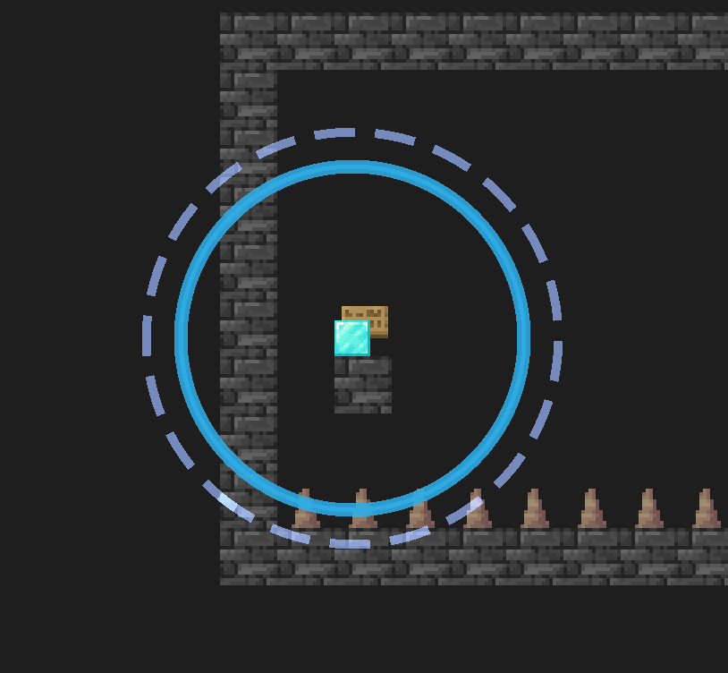
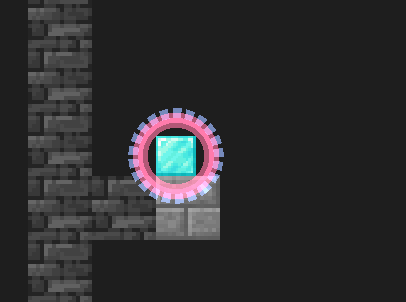

# Intro


This is a emulated game (i.e. idea referenced) of another great game called "Focus".

This also is a university final project of "intro to programming I".

The thing is written with allegro 5.

Programming: Me + Another teammate
Visual & Design: Another teammate

# Sketch tutorial

Press arrow keys to move / select things

Hold A to focus, then you can use arrow key and releasing A key will teleport you to the selected position.

You can only teleport if you have a circle aroud you



The circle indicates where you can teleport, and the radius represents your "focus" amount. When the circle is small, it becomes red, and then you've run out of the "focus". You can't focus if you run out of "focus".



Press L to change between light mode / dark mode

Press D to toggle debug mode on / off

The goal of the game is to step on all target blocks.

# Edit Level Tutorial

You can edit level yourselves.

First, open `lvl_config.txt`.
The default one looks like 

```
11
lvl_0.txt
lvl_1.txt
lvl_2.txt
lvl_3.txt
lvl_4.txt
lvl_5.txt
lvl_6.txt
lvl_7.txt
lvl_8.txt
lvl_9.txt
lvl_a.txt
```

Here, 11 means there are 11 levels and then the following 11 lines of code represents the file name of the level txt, for example, the game will load "level/lvl_0.txt", "level/lvl_1.txt", ... and so on.

The order matters, as it decides the order level player plays.

This file should be modified according to the actual content of the `level` file,
where all level txts is stored.

Take `lvl_6.txt` for example:

```
scale 2
tilemap
19 9
1111111111111111111
1000001090109010001
1000001000100010001
1000001000100010001
10p0001000100010001
1120001070107010701
1000001000100010001
1aaaaa1aaa1aaa1aaa1
1111111111111111111
focus 3
```

which represents this level: 


And take 

`scale` means how large the tilemap should be placed, as compared to the case `scale = 1`

`tilemap` decides the shape, where
first two input is width `W` and height `H`
then there are `H` lines of code, each line should have `W` characters, where

* `0` is air
* `1` is brick/wall
* `2` is another type of brick
* `3` is half brick
* `7` is target block
* `8` is ice
* `9` is crystal
* `a` is spike
* `p` is position of player

* `A` to `F` are sign with fixed content, reserved for in-game tutorial purpose.


